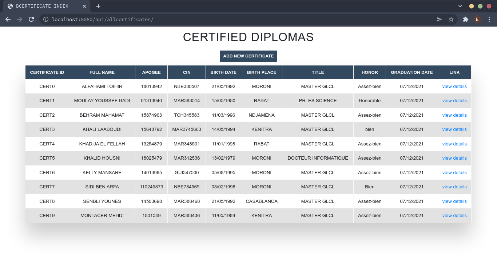
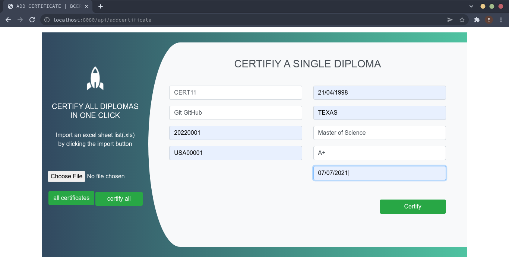
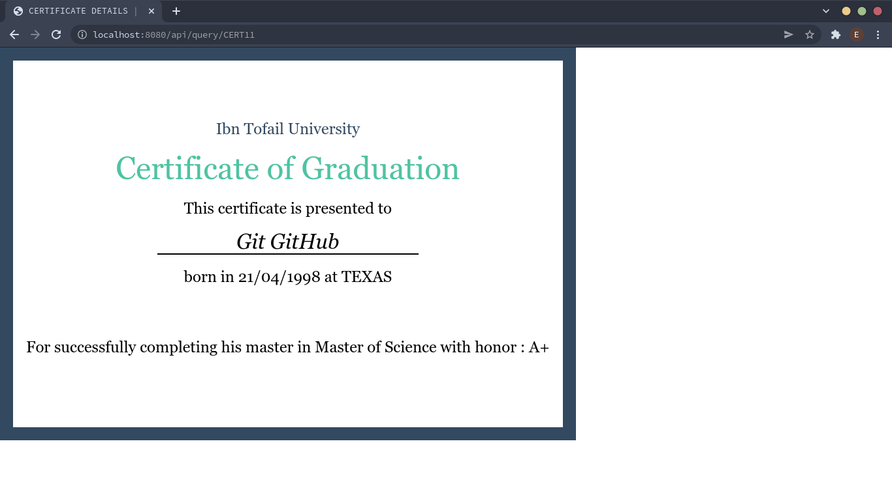

# Quick intro

**BCertificate** is a Hyperledger blockchain full application that automates the issuance, dispatch, and management of university's digital credentials (diplomas, skills, transcripts, degree certifications, etc).

A blockchain network that let schools, colleges and universities add their credentials in the blockchain which could help against fraud papers.

The network is build using [Hyperledger Fabric V2.X.X](https://www.hyperledger.org/use/fabric) and the test were made on **_Linux/Debian 10 Buster_** machine. 
The web app is built with **_NodeJS_**, **_ExpressJS_**, **_REST API_** and pug template engine as a render for the front-end.

## Configuration and running
**BCertificate** is built on top of Hyperledger Linux foundation, thus it's a must to install and configure Hyperledger first.

### Hyperledger installation and configuration

*Prerequisites*:
  - Install and configure Docker (tons of tutorial on the web, )
  - Install curl (`sudo apt update && sudo apt upgrade` then `sudo apt install curl` on linux machine)

*Hyperledger*:
  - Run this single command to download and install the samples, binaries, and docker image of the latest production release of HL:

  - `curl -sSL https://bit.ly/2ysbOFE | bash -s`
  - Find more details [Official HL documentation](https://hyperledger-fabric.readthedocs.io/en/release-2.2/install.html)
  - Run the test-network as described in [using the test-network tutoriel](https://hyperledger-fabric.readthedocs.io/en/release-2.2/test_network.html) to make sure that everything is set up.

### BCertificate, installation and running
Now how to get start our network and get our web app running?

First and foremost, download or clone this repo.\
Repo structure:
  - **_test-network/add_path_org1.sh_** : 
  a script that adds *peer cli*, *peer* and *fabric config* related path with org1's environment variables.\
  Copy this file to *fabric-samples/test-network*.

  - **_chaincode/certificate/_**: contains our smart contract code (**_javascript/_**, **_java/_**) which will be packaged (chaincode), installed and committed to corresponding peers.\
  Copy the folder **_chaincode/certificate/_** to **_fabric-samples/chaincode_**.\
  Open terminal and run `npm install` to install packages. 
  
  - **_certificate/_** : contains our client application and is the starting point of our application.\
    * **_startBCertificate.sh_** is the script that going to start our network, bringing up HL docker images, creating channel, packaging, installing and deploying our chaincode.\
    *Note* : We're deploying our chaincode by nitializing our ledger which is done by requesting and invoking a chaincode initialization function (initLedger).\
    Check the flag **_cci_** in `./network.sh deployCC -ccn certificate -ccv 1 -cci initLedger`\
    If you don't want to initialize the ledger, remove `-cci initLedger`

    * **_networkDown.sh_** will bring down our network, which would stop running docker container.\
    Note: If you're restarting the netowrk, you'll probably want to manually remove the chaincode volumes as they'll create conflict. (`docker volumes prune` would remove all your docker volumes)

    * **_javascript/_** is where we're going to *enroll ou admin*, *registrer our user* (so he/she can run transaction in the started network by invoking the chaincode) and *querying the ledger* as we've deployed our chaincode while initializing it.\
    Run `npm install` before using any script. 

    * **_java/_** same as *javascript/*, contains our administration scripts.
    Not fully implemented and neither fully tested.\

    * **_apiserver/_** is our nodeJS application. It contains same administration scripts in *javascript/* and more.\
    Run `npm install` before using any enrolling admin, registering the user and invoking transactions.\
    
    * Copy **_certificate/_** and paste to **_fabric/samples/_** 

Now that we went through all the folder and script let's see how we to start the app step by step :
  - Make sure you are in *fabric-samples/certificate* run the following commands on your terminal:
    
    * `./startBCertificate.sh` 
    * `cd apiserver/` 
    * `node enrollAdmin.js && node registerUser.js && node query.js`
    * `node apiserver.js` 
    * Now you can visit [http://localhost:8080/api/](http://localhost:8080/api/) or [http://localhost:8080/api/allcertificates](http://localhost:8080/api/allcertificates) to see already added certificates.

  ### Front-end views:

  All certificates\
  [http://localhost:8080/api/allcertificates](http://localhost:8080/api/allcertificates)

Adding a certificate\
Note that one can add a list of certificate by importing an excel sheet (.xls).
[http://localhost:8080/api/addcertificate](http://localhost:8080/api/addcertificate)

Git GitHub's certificate\
[http://localhost:8080/api/query/CERT11](http://localhost:8080/api/query/CERT11)

#### Contributions, remarks & questions
Please contact me by email in case you've got questions, remarks, ... regarding the project.\
Feel free to contribute by creating an [issue](https://github.com/alfahami/bcertificate/issues/new) and/or a [pull request](https://github.com/alfahami/bcertificate/pulls). \
The main focus was on getting familiar with Hyperledger and its different ways of building blockchain solutions. 

### Author
 [AL-FAHAMI TOIHIR](https://alfahami.github.io/ "Resume and protfolio page")\
 [FACULTY OF SCIENCE - KENITRA](http://fs.uit.ac.ma/ "Site officiel")\
 MATHEMATICS & COMPUTER SCIENCE DEPARTMENT
 
 ### Licence: 
 This project is avalaible as open source under the terms of [licence MIT](https://opensource.org/licenses/MIT).

